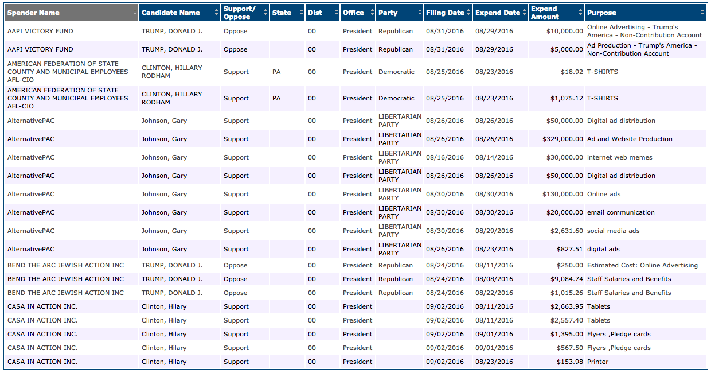
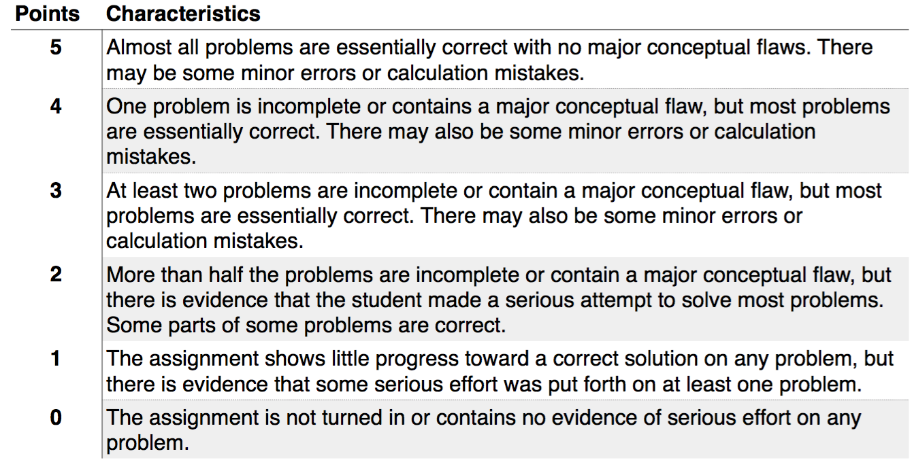
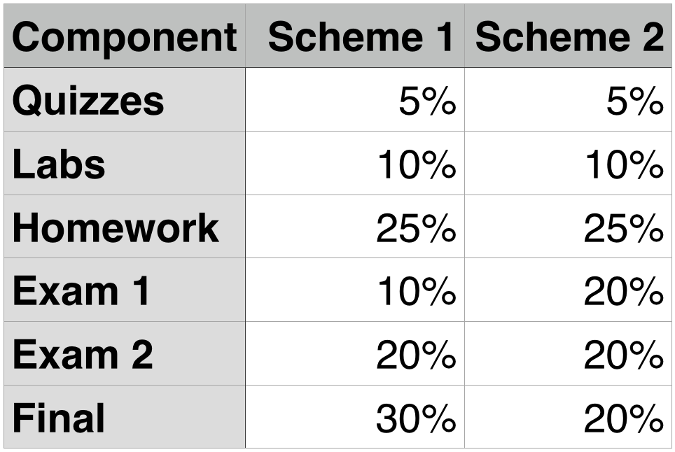

# [fit] Math 107
# [fit] Elementary
# [fit] Statistics

---

# [fit] What are we going to learn in this course?

#### Credit: [Hadley Wickham](http://hadley.nz/)

---

# Federal Election Committee Data

* 2016 presidential election independent expenditures reported to the FEC

* Independent expenditures: "spending by individual people, groups, political committees, corporations or unions expressly advocating the election or defeat of clearly identified federal candidates"

* Information: who was paid, purpose, date, amount, for/against whom

---

---

# What questions might we ask this data set?

---

# How do these questions guide our analysis?

---

# [fit] Syllabus

---

# Prerequisites

### [fit] High school algebra + Sophomore standing

---

# [fit] math107-lu.github.io

---

# Piazza

Question-and-answer system designed to streamline class discussion outside of the classroom

 

Great first place to ask about the course, lecture/reading, or the assignments.

---

# Moodle

Check your grades

 

Take reading quizzes

---

# Textbook

*Statistics: Unlocking the Power of Data*, Lock et al., 2013, John Wiley & Sons, 
ISBN 978-0-470-60187-7.

---

# Homework

Assigned on Mondays (due Fridays by 4 pm) and Fridays (due Tuesdays by 4 pm). 

**No late work will be accepted.**

20% of grade. Lowest two dropped.

Exceptionally messy, hard to read, or unstapled homework will receive a 20% penalty. This penalty can be lifted by turning in a cleanly written copy, or a photo of you holding a stapler.

---

# Homework Grading Scale

---

# Quizzes

---

# Lab days

Approximately weekly

Completed in groups that I will assign

10% of the final grade

---

# Exams + Final

Exam 1 (tentative) - 

Exam 2 (tentative) - 

Final - Tuesday, November 22 at 8 a.m.

---

# Final grade

# Maximum of the following two weighting schemes

---

# Honor Code

You may collaborate on homework but you must submit your own assignment that reflects your own thinking, work and organization.

To check if your homework meets this standard, imagine I asked you to explain your reasoning for each problem—you should be able to do so with ease.

All assignments are considered to be pledged to this standard.

---

# Honor Code

Cell phones should neither be heard nor seen during an exam

---

# Office Hours

### 410 Briggs Hall

Monday 1:50-3:50

Tuesday 1:50-3:20

Wednesday 3:10-4:20

Friday 1:50-3:50

---

# Computing

We will use the statistical language R to achieve our computational goals in this course. 

 

 

Install R and RStudio today so that you can resolve any issues before you need it for an assignment.

---

# rstudio.lawrence.edu

---

