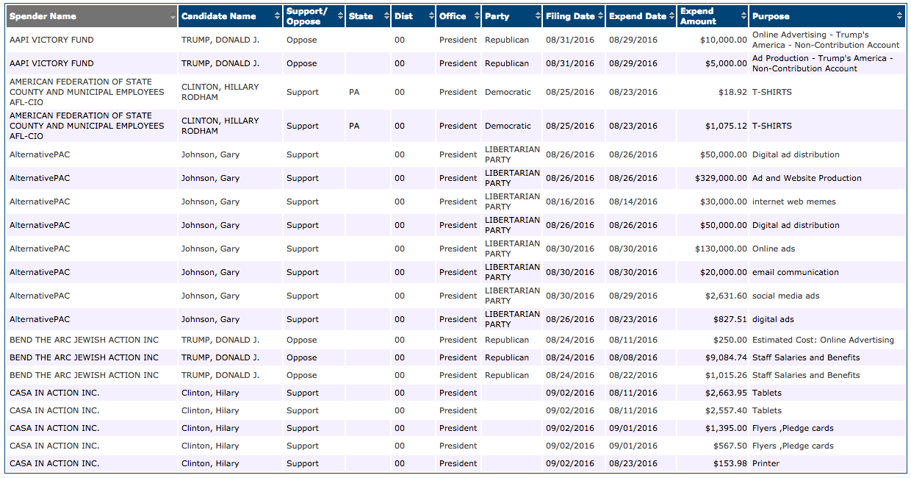

# [fit] Introduction to
# [fit] data

---

# Data

A set of measurements taken on a set of individuals

---

---

#  What are the **cases** (what do the rows represent)?

---

---

# What **variables** do we have (what characteristics do we have on each case)?

---

---

# Are the variables **categorical** (values that are names of categories) or **quantitative** (measured numerical values with units)?

---

---

# [fit] Tidy 
# [fit] data

---

# Data are tidy if...

Each variable forms a column

Each case forms a row

Each value of a variable is stored in a cell

No footnotes

No units

---

# Why do we care?

Tidy data sets are easy to manipulate, visualize and model. 

---

Example - Tidy

---

Example - Untidy