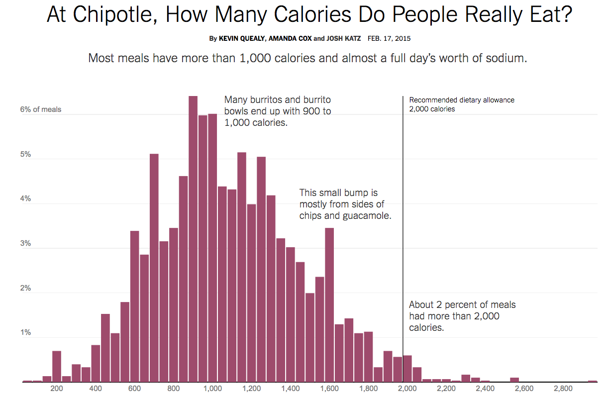
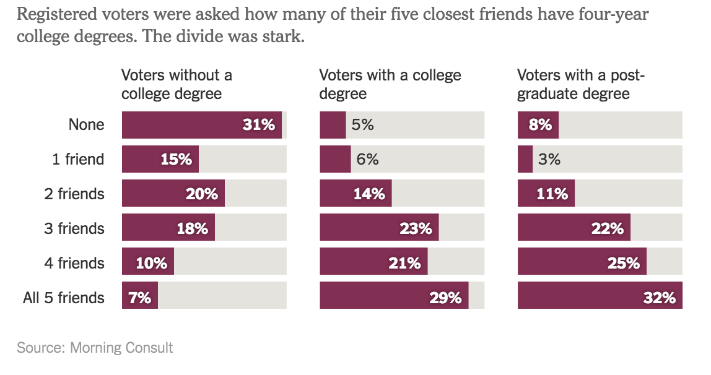

# [fit] Introduction to
# [fit] statistical
# [fit] graphics

---

> The greatest value of a picture is when it forces us to notice what we never expected to see.
-- John Tukey

---

> Numbers have an important story to tell. They rely on you to give them a clear and convincing voice.
-- Stephen Few

---

# Goals

1. Establish a set of simple graphical tools that allow you to make powerful insights about your data     

2. Establish a common vocabulary to discuss graphical findings    

3. A sprinkle of good perception (REWORD)

---

# [fit] displaying a
# [fit] distribution

---

---

---

---

# [fit] comparisons
# [fit] over time

---

---

---

# [fit] displaying
# [fit] associations

---

scatterplots

---

---

---

---

using color/glyphs

---

# [fit] Label
# [fit] axes

---

# [fit] Include
# [fit] units

---

# [fit] Choose the
# [fit] right
# [fit] display

---

# [fit] Use
# [fit] color
# [fit] strategically

---

# [fit] What
# [fit] not
# [fit] to do

---

# Additional reading for the interested student
