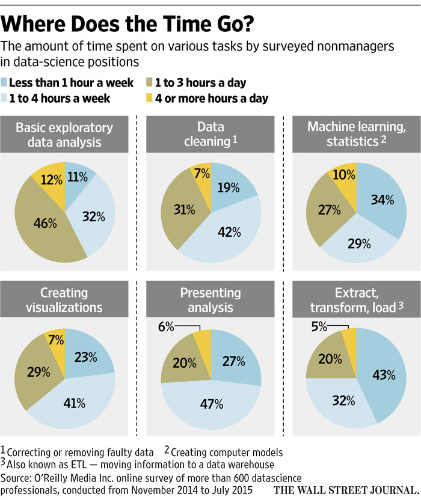
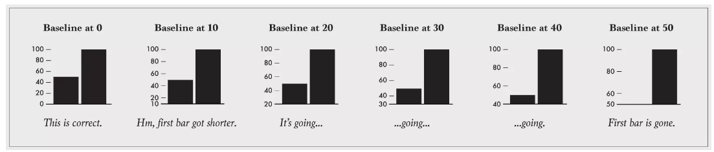
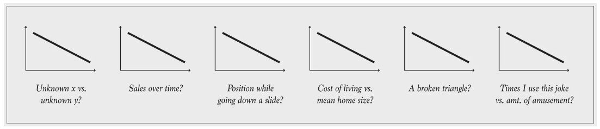
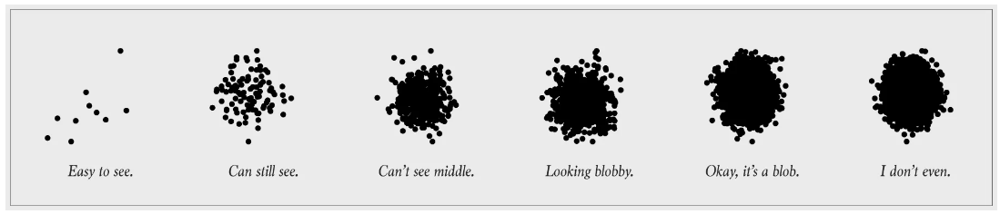

# [fit] Introduction to
# [fit] statistical
# [fit] graphics

---

> The greatest value of a picture is when it forces us to notice what we never expected to see.
-- John Tukey

---

> Numbers have an important story to tell. They rely on you to give them a clear and convincing voice.
-- Stephen Few

---

# Goals

1. Establish a set of simple graphical tools that allow you to make powerful insights about your data     

2. Establish a common vocabulary to discuss graphical findings    

3. Establish good habits

---

# [fit] displaying a
# [fit] distribution

---

---

---

---

# [fit] comparisons
# [fit] over time

---

---

# [fit] displaying
# [fit] associations

---

---

---

---

---

---

---

---

---

---

# [fit] good
# [fit] practices

---

# Don't use pie charts

---

---

# Meaningfully order your bar charts and boxplots

---

# Bar charts start with a zero baseline

 

#### Source: [flowingdata.com](http://flowingdata.com/2015/08/11/real-chart-rules-to-follow/) 

---

# Experiment with histogram binwidth

  

---

# Label your axes, includng units

#### Source: [flowingdata.com](http://flowingdata.com/2015/08/11/real-chart-rules-to-follow/) 

---

# Use color strategically

---

# Avoid overplotting

 

#### Source: [flowingdata.com](http://flowingdata.com/2015/08/11/real-chart-rules-to-follow/) 

---

# Additional reading for the interested student

  

---

# Credits

