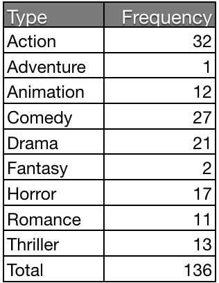
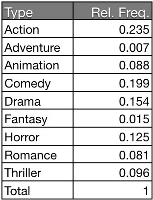
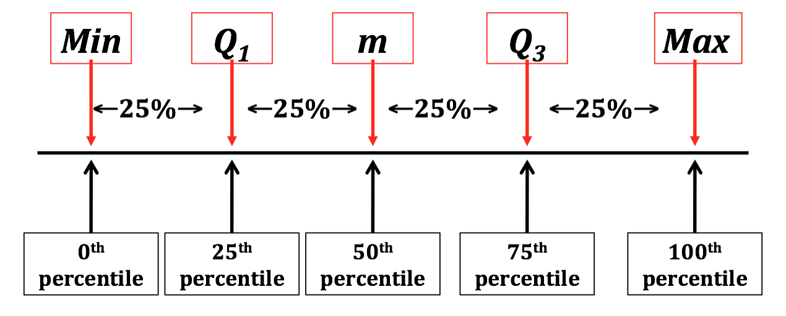

#[fit] Summary
#[fit] Statistics

---

#[fit] Categorical
#[fit] Variables

---

# Frequency table

---

# Relative frequency table

---

#[fit] Quantitative
#[fit] Variables

---

#[fit] Measures of
#[fit] Center

---

# Mean

Formula: $$\overline{x} = \frac{1}{n} \sum_{i=1}^n x_i$$

Interpretation: center of mass

 

Resistant?

---

# Median

Formula: 

- if $$n$$ is odd, then find the center value 
- if $$n$$ is even, then find the average of the two center values

Interpretation: center value (50th percentile)

 

Resistant?

---

# Outliers

When using statistics that are not resistant to outliers:

1. Check whether there was a data recording error

2. If there wasn't, check whether the outlier is part of the target population.

3. If it is, run analysis **with and without** the outlier. Report both analyses and on their differences.

---

#[fit] Other Measures of
#[fit] Location

---

# Percentiles

The $$p^{\text{th}}$$ percentile is the value that is greater than $$p\%$$ of the data.

---

# Quartiles

**Quartiles** divide the ordered data into four equal parts.

---

# Five number summary

---

#[fit] Measures of
#[fit] Spread

---

# Why we need to measure the spread

---

# Standard deviation

Formula: $$s=\sqrt{\frac{1}{n-1} \sum_{i=1}^n (x_i - \overline{x})^2}$$

Interpretation: "average" distance a typical value falls from the mean  

Resistant?

---

# 95% rule

If a distribution is approximately symmetric and bell shaped, approximately 95% of the data values fall within two standard deviations of the mean.

---

# Interquartile range (IQR)

Formula: $$Q_3 - Q1$$ 

 

Interpretation: spread of the central 50% of the values

 

Resistant?

---

# Range

Formula: $$\max - \min$$ 

 

Interpretation: distance between the extremes

 

Resistant?

---

#[fit] Standardization

---

Why use "standard deviations" from the mean on the y-axis?

---

# Standardized values

The **z-score** is the number of standard deviations a value fall from the mean

For samples: $$z = \frac{x - \overline{x}}{s}$$

For populations: $$z = \frac{x - \mu}{\sigma}$$

---

# Properties of z-scores

- unitless
- z < 0 $$\rightarrow$$ data value is below the mean
- z > 0 $$\rightarrow$$ data value is above the mean
- The larger the z-score, the more unusual the data value

---

# Properties of z-scores

- All observations are on the same scale
	- mean 0
	- standard deviation 1
	
- Standardizing does not change shape of the distribution
	- shifts location (by subtracting off mean)
	- rescales distribution (by dividing by the standard deviation)

---

# Example

The average score on the ACT English exam is 21.0 with a standard deviation of 4.0. 

The average score on the SAT Verbal exam is 520 with a standard deviation of 100.

If Ann scores a 27 on the ACT English exam and Denise scores a 770 on the SAT Verbal exam, who has the better score?

----

# Example

The average score on the ACT Math exam is 20.7 with a standard deviation of 4.1. 

The average score on the SAT Math exam is 510 with a standard deviation of 100.

If Jim scores a 15 on the ACT Math exam and Dwight scores a 340 on the SAT Math exam, who has the better score?