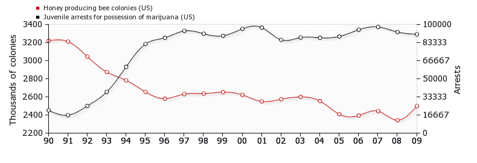
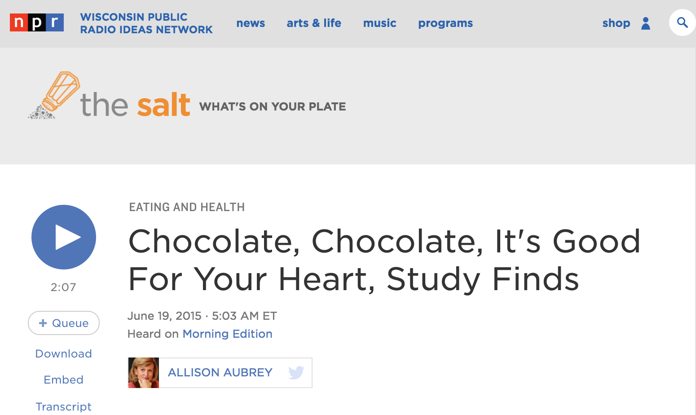

#[fit] Establishing
#[fit] Causality

---

# Association v. Causation

**Association:** values of one variable tends to be related to values of the other variable

 

**Causal association:** changing the value of the explanatory variable changes the values of the response variable

---

# Your turn

Come up with two variables that are associated, but not causally.   

Come up with two variables that are causally associated.   

Turn to the person next to you and discuss for two minutes. 

---

---

---

# Confounding varible

A third variable that is associated with both the explanatory and response variable

 

Causal association cannot be determined when present

---

---

# Study details

Individuals/subjects/participants/units 

- European adults

Explanatory variable

- chocolate consumption

Response variable

- heart disease

---

# Key finding

"Among those in the top tier of chocolate consumption, 12 percent developed or died of cardiovascular disease during the study, compared to 17.4 percent of those who didn't eat chocolate."

### Howard LeWine of Harvard Health Blog

---

# Key limitation

"It doesn't prove a cause-and-effect relationship between chocolate and reduced risk of heart disease and stroke" 

### JoAnn Manson, chief of the Division of Preventive Medicine at Brigham and Women's Hospital, Boston

---

# Observational studies

The researcher simply observes what happens

---

# Experiments

The researcher manipulates at least one explanatory variable (treatment)

---

An article about handwriting appeared in the October 11, 2006 issue of the Washington Post. The article mentioned that among students who took the essay portion of the SAT exam in 2005-06, those who wrote in cursive scored significantly higher on the essay, on average, than students who used printed block letters.

---

The same Washington Post article also mentioned a different study in which the identical essay was shown to many graders, but some graders were randomly chosen to see a cursive version of the essay and the other graders were shown a version with printed block letters. The average score assigned to the essay with the cursive style was significantly higher than the average score assigned to the essay with the printed block letters.

---

# Establishing causation

In order to establish causation, an experiment must

1. **Manipulate** explanatory variables (sometimes called factors) to create treatments  

2. **Randomly assign** subjects (experimental units) to treatment groups  

3. **Compare** the responses of experimental units across treatment groups

---

# Key idea

If the treatment groups are similar apart from the treatment, then a difference in outcomes can be ascribed to the treatment.