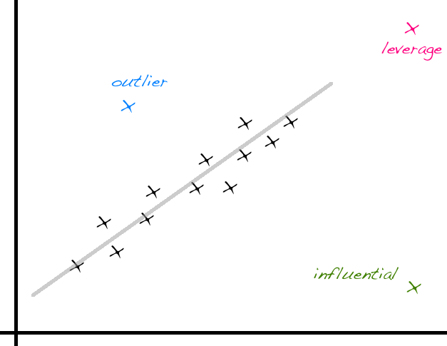

# [fit] Assessing 
# [fit] the Model

---

# Union Bank of Switzerland (UBS) reports

Produces regular reports on prices & earnings in major cities throughout the world, in minutes of labor required for "typical" worker to purchase the commodity:
    
- prices of basic commodities (1 kg rice, 1 kg bread)
- price of a Big Mac at McDonald's

Data from 2003 (before recession) and 2009 (after recession) reports

---

		cor(bigmac2009 ~ bigmac2003, data = UBSprices)
		[1] 0.804481

---

		bigmac.lm <- lm(bigmac2009 ~ bigmac2003, data = UBSprices)
		summary(bigmac.lm)
		
		Call:
		lm(formula = bigmac2009 ~ bigmac2003, data = UBSprices)
		
		Residuals:
		    Min      1Q  Median      3Q     Max 
		-32.968  -5.258  -2.159   0.187  77.081 
		
		Coefficients:
		            Estimate Std. Error t value Pr(>|t|)    
		(Intercept)  6.73612    3.84985   1.750   0.0861 .  
		bigmac2003   0.77886    0.07975   9.767 2.33e-13 ***
		---
		Signif. codes:  0 ‘***’ 0.001 ‘**’ 0.01 ‘*’ 0.05 ‘.’ 0.1 ‘ ’ 1
		
		Residual standard error: 18.35 on 52 degrees of freedom
		Multiple R-squared:  0.6472,	Adjusted R-squared:  0.6404 
		F-statistic: 95.39 on 1 and 52 DF,  p-value: 2.334e-13

---

# [fit] Bootstrapping 
# [fit] regression 
# [fit] models

---

1. Number cases in data set from 1 to n.  

2. Take a random sample *with replacement* of size n from these numbers.  

3. Create a new data set by pulling the rows (cases) from the original data set that were selected in the random sample.  
    
4. Fit the regression model to this new data set and save the values of the estimated coefficients or other summary statistics.  

5. Repeat steps 2-4 R times.

---

# Bootstrap confidence intervals

95% plug-in intervals

 
 

Percentile intervals

---
# Plug-in intervals in R

		bigmac.boot <- Boot(bigmac.lm, R = 999)

		summary(bigmac.boot)

		              R original    bootBias  bootSE bootMed
		(Intercept) 999  6.73612 -0.01700515 2.84323 6.69652
		bigmac2003  999  0.77886  0.00049195 0.12613 0.77432

---
### Interpreting confidence intervals for the slope

---

# Are the bootstrap distributions bell-shaped?

		hist(bigmac.boot, col = "gray")

---
# Percentile intervals in R

		confint(bigmac.boot, type = "perc", level = .95)

		Bootstrap quantiles, type =  percent 

                	    2.5 %    97.5 %
		(Intercept) 0.2406487 12.243993
		bigmac2003  0.5309925  1.058041

---

# [fit] Is the model 
# [fit] any good?

---

# Coefficient of determination: R2

**Interpretation**: Proportion of the variability in y explained by the linear model.

**Calculation**: For single variable regression, R2 = r2

**Intuition**: A better model explains more of the variability in y

**Pitfall**: R2 does not talk about predictive ability of the model

---

		summary(bigmac.lm)
		
		Call:
		lm(formula = bigmac2009 ~ bigmac2003, data = UBSprices)
		
		Residuals:
		    Min      1Q  Median      3Q     Max 
		-32.968  -5.258  -2.159   0.187  77.081 
		
		Coefficients:
		            Estimate Std. Error t value Pr(>|t|)    
		(Intercept)  6.73612    3.84985   1.750   0.0861 .  
		bigmac2003   0.77886    0.07975   9.767 2.33e-13 ***
		---
		Signif. codes:  0 ‘***’ 0.001 ‘**’ 0.01 ‘*’ 0.05 ‘.’ 0.1 ‘ ’ 1
		
		Residual standard error: 18.35 on 52 degrees of freedom
		Multiple R-squared:  0.6472,	Adjusted R-squared:  0.6404 
		F-statistic: 95.39 on 1 and 52 DF,  p-value: 2.334e-13

---

# Model assumptions

Linearity    

Constant variability around the line    

Bell-shaped residuals

---

# Residuals

$$e_i = y_i - \widehat{y}_i$$

 

---

# Residuals

$$e_i = y_i - \widehat{y}_i$$

 

---

# Calibrate your intuition

[https://gallery.shinyapps.io/slr_diag/](https://gallery.shinyapps.io/slr_diag/)

---

# [fit] Outliers

---

# Leverage point 

Away from the cloud of points horizontally

 

Does not necessarily change the slope

---

# Influential point 

Changes the slope (most likely also has high leverage) 

 

Run the regression with and without that point to determine

---

# Outlier 

An unusual point without these special characteristics (this one likely affects the intercept only) 

 

If clusters (groups of points) are apparent in the data, it might be worthwhile to model the groups separately